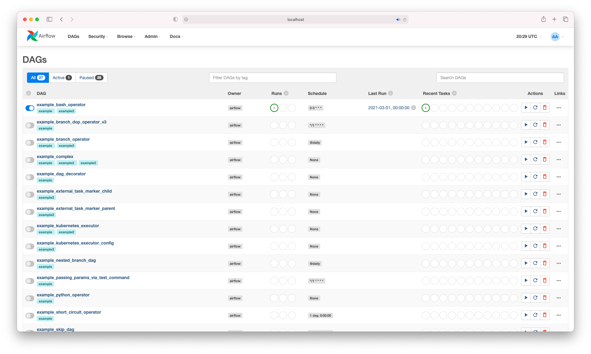

# Apache Airflow Tutorial Series [YouTube](https://www.youtube.com/watch?v=z7xyNOF8tak&list=PLwFJcsJ61oujAqYpMp1kdUBcPG0sE0QMT)
## Updated Tutorial Episode
1. [Introduction and Local Installation](https://www.youtube.com/watch?v=z7xyNOF8tak&list=PLwFJcsJ61oujAqYpMp1kdUBcPG0sE0QMT&index=1)
2. [Get Airflow running in Docker](https://www.youtube.com/watch?v=J6azvFhndLg&list=PLwFJcsJ61oujAqYpMp1kdUBcPG0sE0QMT&index=2)
3. [Airflow Core Concepts in 5 mins](https://www.youtube.com/watch?v=mtJHMdoi_Gg&list=PLwFJcsJ61oujAqYpMp1kdUBcPG0sE0QMT&index=3)
4. [Airflow Task Lifecycle and Basic Architecture](https://www.youtube.com/watch?v=UFsCvWjQT4w&list=PLwFJcsJ61oujAqYpMp1kdUBcPG0sE0QMT&index=4)
5. [Airflow DAG with BashOperator](https://www.youtube.com/watch?v=CLkzXrjrFKg&list=PLwFJcsJ61oujAqYpMp1kdUBcPG0sE0QMT&index=5)
6. [Airflow DAG with PythonOperator and XComs](https://www.youtube.com/watch?v=IumQX-mm20Y&list=PLwFJcsJ61oujAqYpMp1kdUBcPG0sE0QMT&index=6)
7. [Airflow TaskFlow API](https://www.youtube.com/watch?v=9y0mqWsok_4&list=PLwFJcsJ61oujAqYpMp1kdUBcPG0sE0QMT&index=7)
8. [Airflow Catchup and Backfill](https://www.youtube.com/watch?v=OXOiUeHOQ-0&list=PLwFJcsJ61oujAqYpMp1kdUBcPG0sE0QMT&index=8)
9. [Schedule Airflow DAG with Cron Expression](https://www.youtube.com/watch?v=tpuovQFUByk&list=PLwFJcsJ61oujAqYpMp1kdUBcPG0sE0QMT&index=9)
10. [Airflow Connection and PostgresOperator](https://www.youtube.com/watch?v=S1eapG6gjLU&list=PLwFJcsJ61oujAqYpMp1kdUBcPG0sE0QMT&index=10)
11. [Add Python Dependencies via Airflow Docker Image Extending and Customizing](https://www.youtube.com/watch?v=0UepvC9X4HY&list=PLwFJcsJ61oujAqYpMp1kdUBcPG0sE0QMT&index=11)
12. [AWS S3 Key Sensor Operator](https://www.youtube.com/watch?v=vuxrhipJMCk&list=PLwFJcsJ61oujAqYpMp1kdUBcPG0sE0QMT&index=12)
13. [Airflow Hooks S3 PostgreSQL](https://www.youtube.com/watch?v=rcG4WNwi900&list=PLwFJcsJ61oujAqYpMp1kdUBcPG0sE0QMT&index=13)

## Running apache airflow 2.0 in docker with local executor.
Here are the steps to take to get airflow 2.0 running with docker on your machine. 
1. Clone this repo
1. Create dags, logs and plugins folder inside the project directory
```bash
mkdir ./dags ./logs ./plugins
```
1. Install docker desktop application if you don't have docker running on your machine
- [Download Docker Desktop Application for Mac OS](https://hub.docker.com/editions/community/docker-ce-desktop-mac)
- [Download Docker Desktop Application for Windows](https://hub.docker.com/editions/community/docker-ce-desktop-windows)
1. Launch airflow by docker-compose
```bash
docker-compose up -d
```
1. Check the running containers
```bash
docker ps
```
1. Open browser and type http://0.0.0.0:8080 to launch the airflow webserver

